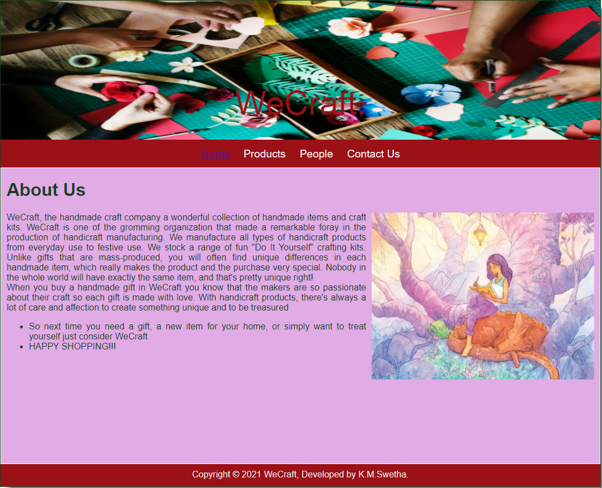
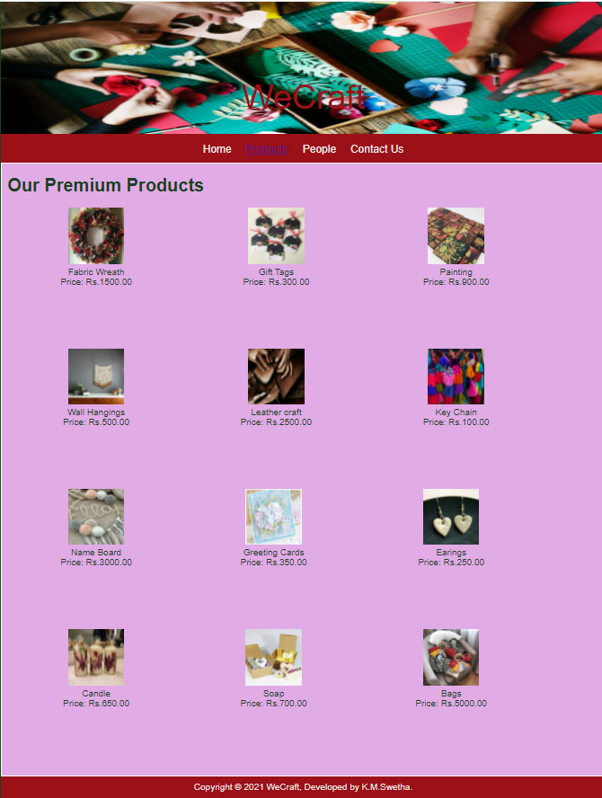
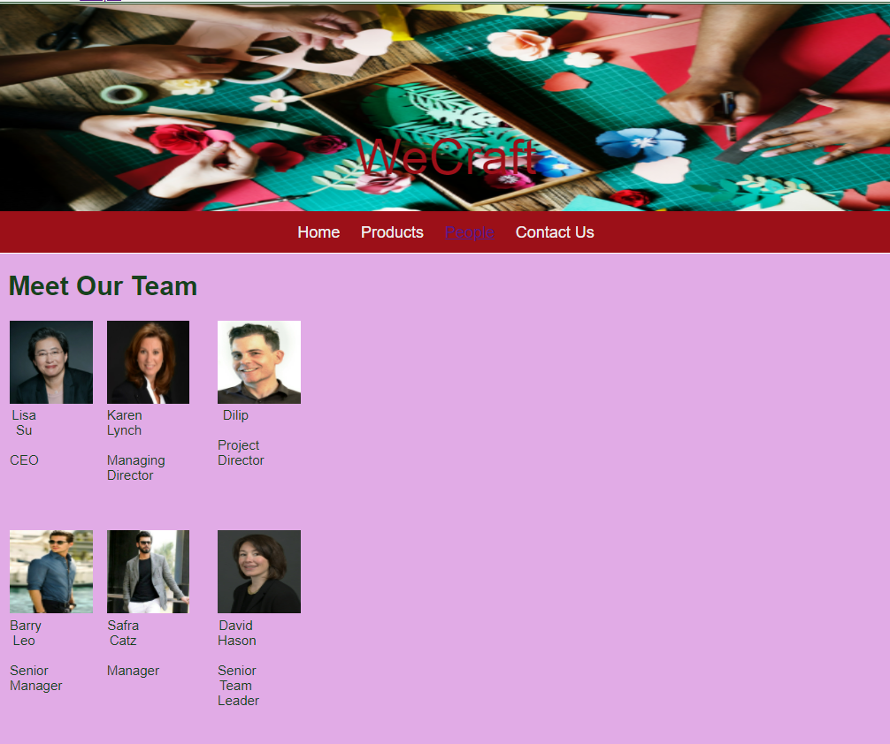
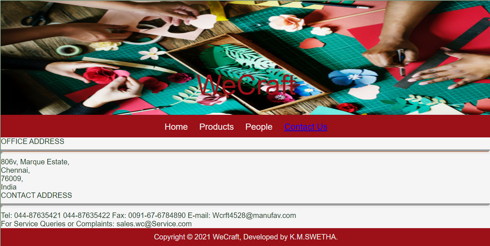

# Web Design for a Software Product Company

## AIM:

To design a static website for a software product company company.

## DESIGN STEPS:

### Step 1:

Requirement collection.

### Step 2:

Creating the layout using HTML and CSS.

### Step 3:

Updating the sample content.

### Step 4:

Choose the appropriate style and color scheme.

### Step 5:

Validate the layout in various browsers.

### Step 6:

Validate the HTML code.

### Step 6:

Publish the website in the given URL.

## PROGRAM :
<<<<<<< HEAD
 HOME:
```<!DOCTYPE html>
=======
### HOME PAGE CODE:
 ``` <!DOCTYPE html>
>>>>>>> b85646216e6e56cbf71c92eb1f51efaeea628653
<html lang="en">
  <head>
    <title>WE-CRAFT </title>
    <link rel="stylesheet" href="./css/layout.css" />
    <link rel="icon" href="./img/icon.png" type="image/x-icon" />
  </head>
<<<<<<< HEAD
=======

  <body>
    <div class="container">
      <div class="banner">WeCraft.</div>
      <div class="menu">
        <div class="menuitemselected"><a href="/static/home.html">Home</a></div>
        <div class="menuitem"><a href="/static/products.html">Products</a></div>
        <div class="menuitem"><a>People</a></div>
        <div class="menuitem"><a>Contact Us</a></div>
      </div>
      <div class="content">
        <div class="homecontent">
          <h1>About Us</h1>
          
          <div class="contenttext">
            WeCraft, the handmade craft company a wonderful collection of
            handmade items and craft kits. WeCraft is one of the gromming 
            organization that made a remarkable foray in the production of 
            handicraft manufacturing. We manufacture all types of handicraft
            products from everyday use to festive use.
            We stock a range of fun "Do It Yourself" crafting kits.
            Unlike gifts that are mass-produced, you will often find unique 
            differences in each handmade item, which really makes the product and 
            the purchase very special. Nobody in the whole world will have exactly the 
            same item, and that's pretty unique right!
            <br />
            When you buy a handmade gift in WeCraft you know that the makers are so 
            passionate about their craft so each gift is made with love. 
            With handicraft products, there's always a lot of care and affection
            to create something unique and to be treasured 
            <ul>
              <li>So next time you need a gift, a new item for your home, 
                or simply want to treat yourself just consider WeCraft
              </li>
              <li>HAPPY SHOPPING!!!</li>
            </ul>
          </div>
        </div>
      </div>
      <div class="footer">
        Copyright &#169; 2021 WeCraft, Developed by K.M.Swetha.
      </div>
    </div>
  </body>
</html>
```


### PRODUCT PAGE CODE:
```<!DOCTYPE html>
<html lang="en">
  <head>
    <title>WeCraft</title>
    <link rel="stylesheet" href="./css/layout.css" />
    <link rel="icon" href="./img/icon.png" type="image/x-icon" />
  </head>

  <body>
    <div class="container">
      <div class="banner">WeCraft</div>
      <div class="menu">
        <div class="menuitem"><a href="/static/home.html">Home</a></div>
        <div class="menuitemselected">
          <a href="/static/products.html">Products</a>
        </div>
        <div class="menuitem"><a>People</a></div>
        <div class="menuitem"><a>Contact Us</a></div>
      </div>
      <div class="content">
        <div class="productcontent">    
          <h1>Our Premium Products</h1>
          <div class="productitems">
              <div class="productitem"> 
                  <div class="itemimage">
                  
                  </div>
                  <div class="itemname">Fabric Wreath</div>
                  <div class="itemprice">Price: Rs.1500.00 </div>
              </div>
              <div class="productitem"> 
                  <div class="itemimage">
                  
                  </div>
                  <div class="itemname">Gift Tags</div>
                  <div class="itemprice">Price: Rs.300.00 </div>
              </div>
              <div class="productitem"> 
                <div class="itemimage">
                
                </div>
                <div class="itemname">Painting</div>
                <div class="itemprice">Price: Rs.900.00 </div>
            </div>
            <div class="productitem"> 
              <div class="itemimage">
              
              </div>
              <div class="itemname">Wall Hangings</div>
              <div class="itemprice">Price: Rs.500.00 </div>
          </div>
          <div class="productitem"> 
            <div class="itemimage">
            
            </div>
            <div class="itemname">Leather craft</div>
            <div class="itemprice">Price: Rs.2500.00 </div>
          </div> <div class="productitem"> 
          <div class="itemimage">
          
          </div>
          <div class="itemname">Key Chain</div>
          <div class="itemprice">Price: Rs.100.00 </div>
          </div>
          <div class="productitem"> 
            <div class="itemimage">
            
            </div>
            <div class="itemname">Name Board</div>
            <div class="itemprice">Price: Rs.3000.00 </div>
        </div><div class="productitem"> 
          <div class="itemimage">
          
          </div>
          <div class="itemname">Greeting Cards</div>
          <div class="itemprice">Price: Rs.350.00 </div>
      </div><div class="productitem"> 
        <div class="itemimage">
        
        </div>
        <div class="itemname">Earings</div>
        <div class="itemprice">Price: Rs.250.00 </div>
    </div><div class="productitem"> 
      <div class="itemimage">
      
      </div>
      <div class="itemname">Candle</div>
      <div class="itemprice">Price: Rs.650.00 </div>
  </div><div class="productitem"> 
    <div class="itemimage">
    
    </div>
    <div class="itemname">Soap</div>
    <div class="itemprice">Price: Rs.700.00 </div>
</div><div class="productitem"> 
  <div class="itemimage">
  
  </div>
  <div class="itemname">Bags</div>
  <div class="itemprice">Price: Rs.5000.00 </div>
</div>

          </div>
          </div>        
      </div>
      <div class="footer">
        Copyright &#169; 2021 WeCraft, Developed by K.M.Swetha.
      </div>
    </div>
  </body>
</html>
```


### PEOPLE PAGE CODE:
```<!DOCTYPE html>
<html lang="en">
  <head>
    <title>WeCraft</title>
    <link rel="stylesheet" href="./css/layout.css" />
    <link rel="icon" href="./img/icon.png" type="image/x-icon" />
  </head>

  <body>
    <div class="container">
     
        <div class="menuitem">
          <a href="/static/products.html">Products</a>
        </div>
        <div class="menuitemselected"><a href="/static/people.html">People</a></div>
        <div class="menuitem"><a>Contact Us</a></div>
      </div>
      <div class="content"><!DOCTYPE html>
        <html lang="en">
          <head>
            <title>WeCraft</title>
            <link rel="stylesheet" href="./css/layout.css" />
            <link rel="icon" href="./img/icon.png" type="image/x-icon" />
          </head>
        
          <body>
            <div class="container">
              <div class="banner">WeCraft</div>
              <div class="menu">
                <div class="menuitem"><a href="/static/home.html">Home</a></div>
                <div class="menuitem">
                  <a href="/static/products.html">Products</a>
                </div>
                <div class="menuitemselected"><a href="/static/people.html">People</a></div>
                <div class="menuitem"><a>Contact Us</a></div>
              </div>
              <div class="content">
                <div class="productcontent">    
                  <h1>Meet Our Team</h1>
                  <table>
                    <tr> 
                    <td>
                      <div class="productitem"> 
                          <div class="itemimage">
                          
                          </div>
                          <div class="itemname">Lisa Su </div> <br>
                          <div class="itemprice"> CEO  </div> 
                        </td>
                    <td>
                        <div class="productitem"> 
                            <div class="itemimage">
                            
                            </div>
                            <div class="itemname"> Karen Lynch </div> <br>
                            <div class="itemprice">Managing Director</div>
                        </td>
                        <td>
                            <div class="productitem"> 
                                <div class="itemimage">
                                
                                </div>
                                <div class="itemname">Dilip</div> <br>
                                <div class="itemprice">Project Director</div>
        
                        </td>  
                    </tr>
                    <tr>
                        <td>
                            <div class="productitem"> 
                                <div class="itemimage">
                                
                                </div>
                                <div class="itemname">Barry Leo</div> <br>
                                <div class="itemprice">Senior Manager</div>
                            </td>
                            <td>
                                <div class="productitem"> 
                                    <div class="itemimage">
                                    
                                    </div>
                                    <div class="itemname">Safra Catz</div><br>
                                    <div class="itemprice"> Manager</div>
        
                            </td>
                            <td>
                                <div class="productitem"> 
                                    <div class="itemimage">
                                    
                                    </div>
                                    <div class="itemname">David Hason</div> <br>
                                    <div class="itemprice">Senior Team Leader</div>
                            </td>
        
                    </tr>    
                    </table>
                    </div>
                    </div>
                </body>
                </html>
        

            </tr>    
            </table>
            </div>
            </div>
        </body>
        </html>
  ```
### CONTACT PAGE CODE:
```<!DOCTYPE html>
<html lang="en">
  <head>
    <title>WeCraft</title>
    <link rel="stylesheet" href="./css/layout.css" />
    <link rel="icon" href="./img/icon.png" type="image/x-icon" />
  </head>

  <body>
    <div class="container">
      <div class="banner">WeCraft</div>
      <div class="menu">
        <div class="menuitem"><a href="/static/home.html">Home</a></div>
        <div class="menuitem">
          <a href="/static/products.html">Products</a>
        </div>
        <div class="menuitem"><a href="/static/people.html">People</a></div>
        <div class="menuitemselected"><a href="/static/contactus.html">Contact Us</a></div>
      </div>
      <div class="contactus" background-image="url(/static/img/cbg.jpg")>
          OFFICE ADDRESS <br>
          <hr style="height:2px;border-width:5px;color:#e6752f;background-color: #e6752f">
          
          806v, 
          Marque Estate,<br>
          Chennai,<br>
          76009,<br>
          India<br>

          CONTACT ADDRESS<br>
          <hr style="height:2px;border-width:5px;color:#e6752f;background-color: #e6752f">
          
          Tel: 044-87635421
               044-87635422
          Fax: 0091-67-6784890
          E-mail: Wcrft4528@manufav.com
          <br>
           For Service Queries or Complaints: sales.wc@Service.com
        
        </div>
        <div class="footer">
            Copyright &#169; 2021 WeCraft, Developed by K.M.SWETHA.
          </div>

      </div>
      </body>
      </html>
  ```

>>>>>>> b85646216e6e56cbf71c92eb1f51efaeea628653


  <body>
    <div class="container">
      <div class="banner">WeCraft.</div>
      <div class="menu">
        <div class="menuitemselected"><a href="/static/home.html">Home</a></div>
        <div class="menuitem"><a href="/static/products.html">Products</a></div>
        <div class="menuitem"><a>People</a></div>
        <div class="menuitem"><a>Contact Us</a></div>
      </div>
      <div class="content">
        <div class="homecontent">
          <h1>About Us</h1>
          
          <div class="contenttext">
            WeCraft, the handmade craft company a wonderful collection of
            handmade items and craft kits. WeCraft is one of the gromming 
            organization that made a remarkable foray in the production of 
            handicraft manufacturing. We manufacture all types of handicraft
            products from everyday use to festive use.
            We stock a range of fun "Do It Yourself" crafting kits.
            Unlike gifts that are mass-produced, you will often find unique 
            differences in each handmade item, which really makes the product and 
            the purchase very special. Nobody in the whole world will have exactly the 
            same item, and that's pretty unique right!
            <br />
            When you buy a handmade gift in WeCraft you know that the makers are so 
            passionate about their craft so each gift is made with love. 
            With handicraft products, there's always a lot of care and affection
            to create something unique and to be treasured 
            <ul>
              <li>So next time you need a gift, a new item for your home, 
                or simply want to treat yourself just consider WeCraft
              </li>
              <li>HAPPY SHOPPING!!!</li>
            </ul>
          </div>
        </div>
      </div>
      <div class="footer">
        Copyright &#169; 2021 WeCraft, Developed by K.M.Swetha.
      </div>
    </div>
  </body>
</html>
```
PRODUCTS:
```<!DOCTYPE html>
<html lang="en">
  <head>
    <title>WeCraft</title>
    <link rel="stylesheet" href="./css/layout.css" />
    <link rel="icon" href="./img/icon.png" type="image/x-icon" />
  </head>

  <body>
    <div class="container">
      <div class="banner">WeCraft</div>
      <div class="menu">
        <div class="menuitem"><a href="/static/home.html">Home</a></div>
        <div class="menuitemselected">
          <a href="/static/products.html">Products</a>
        </div>
        <div class="menuitem"><a>People</a></div>
        <div class="menuitem"><a>Contact Us</a></div>
      </div>
      <div class="content">
        <div class="productcontent">    
          <h1>Our Premium Products</h1>
          <div class="productitems">
              <div class="productitem"> 
                  <div class="itemimage">
                  
                  </div>
                  <div class="itemname">Fabric Wreath</div>
                  <div class="itemprice">Price: Rs.1500.00 </div>
              </div>
              <div class="productitem"> 
                  <div class="itemimage">
                  
                  </div>
                  <div class="itemname">Gift Tags</div>
                  <div class="itemprice">Price: Rs.300.00 </div>
              </div>
              <div class="productitem"> 
                <div class="itemimage">
                
                </div>
                <div class="itemname">Painting</div>
                <div class="itemprice">Price: Rs.900.00 </div>
            </div>
            <div class="productitem"> 
              <div class="itemimage">
              
              </div>
              <div class="itemname">Wall Hangings</div>
              <div class="itemprice">Price: Rs.500.00 </div>
          </div>
          <div class="productitem"> 
            <div class="itemimage">
            
            </div>
            <div class="itemname">Leather craft</div>
            <div class="itemprice">Price: Rs.2500.00 </div>
          </div> <div class="productitem"> 
          <div class="itemimage">
          
          </div>
          <div class="itemname">Key Chain</div>
          <div class="itemprice">Price: Rs.100.00 </div>
          </div>
          <div class="productitem"> 
            <div class="itemimage">
            
            </div>
            <div class="itemname">Name Board</div>
            <div class="itemprice">Price: Rs.3000.00 </div>
        </div><div class="productitem"> 
          <div class="itemimage">
          
          </div>
          <div class="itemname">Greeting Cards</div>
          <div class="itemprice">Price: Rs.350.00 </div>
      </div><div class="productitem"> 
        <div class="itemimage">
        
        </div>
        <div class="itemname">Earings</div>
        <div class="itemprice">Price: Rs.250.00 </div>
    </div><div class="productitem"> 
      <div class="itemimage">
      
      </div>
      <div class="itemname">Candle</div>
      <div class="itemprice">Price: Rs.650.00 </div>
  </div><div class="productitem"> 
    <div class="itemimage">
    
    </div>
    <div class="itemname">Soap</div>
    <div class="itemprice">Price: Rs.700.00 </div>
</div><div class="productitem"> 
  <div class="itemimage">
  
  </div>
  <div class="itemname">Bags</div>
  <div class="itemprice">Price: Rs.5000.00 </div>
</div>

</div>
          </div>        
      </div>
      <div class="footer">
        Copyright &#169; 2021 WeCraft, Developed by K.M.Swetha.
      </div>
    </div>
  </body>
</html>
```
PEOPLE:
```<!DOCTYPE html>
<html lang="en">
  <head>
    <title>WeCraft</title>
    <link rel="stylesheet" href="./css/layout.css" />
    <link rel="icon" href="./img/icon.png" type="image/x-icon" />
  </head>

  <body>
    <div class="container">
      <div class="banner">WeCraft</div>
      <div class="menu">
        <div class="menuitem"><a href="/static/home.html">Home</a></div>
        <div class="menuitem">
          <a href="/static/products.html">Products</a>
        </div>
        <div class="menuitemselected"><a href="/static/people.html">People</a></div>
        <div class="menuitem"><a>Contact Us</a></div>
      </div>
      <div class="content">
        <div class="productcontent">    
          <h1>Meet Our Team</h1>
          <table>
            <tr> 
            <td>
              <div class="productitem"> 
                  <div class="itemimage">
                  
                  </div>
                  <div class="itemname">Lisa Su </div> <br>
                  <div class="itemprice"> CEO  </div> 
                </td>
            <td>
                <div class="productitem"> 
                    <div class="itemimage">
                    
                    </div>
                    <div class="itemname"> Karen Lynch </div> <br>
                    <div class="itemprice">Managing Director</div>
                </td>
                <td>
                    <div class="productitem"> 
                        <div class="itemimage">
                        
                        </div>
                        <div class="itemname">Dilip</div> <br>
                        <div class="itemprice">Project Director</div>

</td>  
 </tr>
<tr>
                <td>
                    <div class="productitem"> 
                        <div class="itemimage">
                        
                        </div>
                        <div class="itemname">Barry Leo</div> <br>
                        <div class="itemprice">Senior Manager</div>
                    </td>
                    <td>
                        <div class="productitem"> 
                            <div class="itemimage">
                            
                            </div>
                            <div class="itemname">Safra Catz</div><br>
                            <div class="itemprice"> Manager</div>

</td>
                    <td>
                        <div class="productitem"> 
                            <div class="itemimage">
                            
                            </div>
                            <div class="itemname">David Hason</div> <br>
                            <div class="itemprice">Senior Team Leader</div>
                    </td>

</tr>    
            </table>
            </div>
            </div>
        </body>
        </html>
```
CONTACT US:
```<!DOCTYPE html>
<html lang="en">
  <head>
    <title>WeCraft</title>
    <link rel="stylesheet" href="./css/layout.css" />
    <link rel="icon" href="./img/icon.png" type="image/x-icon" />
  </head>

  <body>
    <div class="container">
      <div class="banner">WeCraft</div>
      <div class="menu">
        <div class="menuitem"><a href="/static/home.html">Home</a></div>
        <div class="menuitem">
          <a href="/static/products.html">Products</a>
        </div>
        <div class="menuitem"><a href="/static/people.html">People</a></div>
        <div class="menuitemselected"><a href="/static/contactus.html">Contact Us</a></div>
      </div>
      <div class="contactus" background-image="url(/static/img/cbg.jpg")>
          OFFICE ADDRESS <br>
          <hr style="height:2px;border-width:5px;color:#e6752f;background-color: #e6752f">
          
 806v, 
          Marque Estate,<br>
          Chennai,<br>
          76009,<br>
          India<br>

CONTACT ADDRESS<br>
          <hr style="height:2px;border-width:5px;color:#e6752f;background-color: #e6752f">
           Tel: 044-87635421
               044-87635422
          Fax: 0091-67-6784890
          E-mail: Wcrft4528@manufav.com
          <br>
           For Service Queries or Complaints: sales.wc@Service.com
        
</div>
        <div class="footer">
            Copyright &#169; 2021 WeCraft, Developed by K.M.SWETHA.
          </div>

 </div>
      </body>
      </html>
```      
## OUTPUT:

### Home Page:
<<<<<<< HEAD

### Product Page:

### People Page:

### Contact Page:

=======


### Product Page:


### People page:


### Contact us page:


>>>>>>> b85646216e6e56cbf71c92eb1f51efaeea628653

## Result:

Thus a website is designed for the software product company and the HTML,CSS code are validated.
